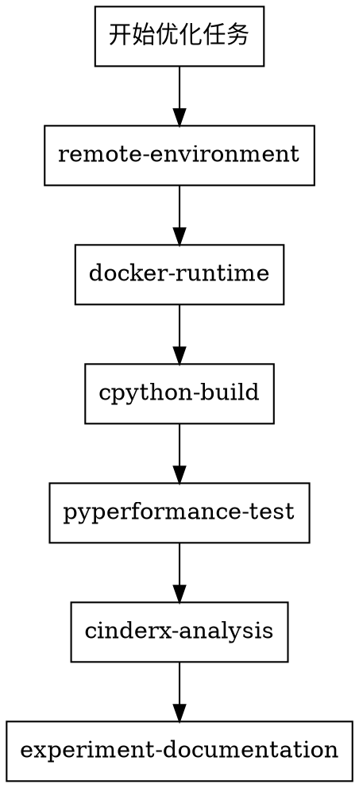

# CPython/CinderX 优化技能引导

本仓库提供 CPython/CinderX 性能优化的系统化工作流。

## 核心原则

- 远程环境默认进入 Docker 容器隔离，不直接在裸机上工作
- 先做项目隔离（宿主机独立目录），再做环境隔离（Docker 容器）
- 构建前先做 API/ABI 版本门禁，以目标解释器和容器内头文件为事实源
- `SIGSEGV` / `exit 139` / core dump 先走 `gdb`、core 和 HIR 证据链，不用反复加日志替代 crash triage
- 远程命令第一次执行就要有输出契约：stdout/stderr、exit status、日志路径或 tmux pane
- 远程异常耗时要区分正常编译和网络卡顿；无进度时先诊断，必要时询问用户
- 先拿可复现证据，再下根因结论
- 用结构化产物沉淀实验结果，避免只留口头结论

## 技能清单

| 技能名 | 触发条件 |
|--------|---------|
| `remote-environment` | 需要连接远程服务器、配置 SSH、创建独立目录 |
| `cpython-build` | 需要编译 CPython 或 CinderX、强制覆盖安装 |
| `docker-runtime` | 需要创建/管理 Docker 容器、挂载目录、镜像复用 |
| `pyperformance-test` | 需要跑 pyperformance benchmark、对比性能数据 |
| `cinderx-analysis` | 需要分析 JIT/非JIT 用例、dump HIR/LIR、定位性能瓶颈 |
| `experiment-documentation` | 需要记录实验结果、写报告、规范产物格式 |
| `design-documentation` | 需要编写系统设计、架构设计、功能设计或详细设计文档 |

## Workflow 清单

Workflow 是多个技能和专门 Agent 的编排入口。优先根据用户目标选择 workflow；只有任务很窄时才直接调用单个原子技能。

| Workflow | 触发条件 | 串联技能 |
|----------|----------|----------|
| `workflow-remote-cinderx-lab-setup` | 从零准备远程 CinderX/CPython 优化实验环境 | `remote-environment` → `docker-runtime` → `cpython-build` → `pyperformance-test` |
| `workflow-cinderx-crash-triage` | 复现、定位、记录 CinderX 或 pyperformance crash | `remote-environment` → `docker-runtime` → `cpython-build` → `pyperformance-test` → `cinderx-analysis` → `experiment-documentation` |
| `workflow-pyperformance-regression` | 正式 benchmark、性能回归、CPython/CinderX 对比 | `docker-runtime` → `cpython-build` → `pyperformance-test` → `cinderx-analysis` → `experiment-documentation` |
| `workflow-jit-optimization-analysis` | 单用例 JIT 热点、HIR/LIR、优化点分析 | `pyperformance-test` → `cinderx-analysis` → `experiment-documentation` |

## 执行顺序

按需进入，不是每步都必须。用户已有环境时跳过对应步骤。

## Docker 线选择

| 目标 | 选择 |
|------|------|
| 验证 benchmark / 抓 HIR / JIT log / crash | `cinderx-test` |
| stock CPython vs CinderX 正式对照 | `cpython-baseline` |
| Docker 与真实环境差异复核 | 回宿主机 |

## 性能口径

正式对比前先明确口径，不要混用：

| 口径 | 说明 |
|------|------|
| `CPython 解释执行` | stock baseline |
| `CPython JIT` | stock JIT 收益 |
| `CinderX 解释执行` | CinderX 不启 JIT |
| `CinderX JIT` | CinderX 最终加速 |

## baseline 的两种含义

写报告时必须说明 `baseline` 指的是什么：
- **口径基线**：比较 CinderX 和原生 CPython
- **提交基线**：比较改动前后提交

## 快速路由

- 只看功能不看性能 → `cinderx-test` + 单 `run_benchmark.py` + 开 HIR dump
- 复现 crash → 单 `run_benchmark.py --worker` + `jit.log` / HIR
- 测试出现 `SIGSEGV` → 保留真实命令 + `gdb bt full` / core dump + 必要 HIR
- 编译报 CPython API 不存在 → 先核对目标解释器、`SOABI`、头文件版本，再决定兼容实现
- 远程命令无输出 → 查 exit status、日志、tmux pane 和进程，不盲目重复执行
- 远程网络/下载异常耗时 → 加 timeout、测镜像/代理/DNS，无法判断时询问用户
- 正式 benchmark → 先关 HIR dump，用 `python -m pyperformance run`
- 修掉 crash / 找到根因 → 必须写文档（调用 `experiment-documentation`）

## Workflow 路由

| 用户意图 | 优先调用 |
|----------|----------|
| "帮我搭一个远程实验环境" | `workflow-remote-cinderx-lab-setup` |
| "某个 benchmark 崩了 / SIGSEGV / core dump" | `workflow-cinderx-crash-triage` |
| "对比性能 / 看回归 / 跑正式 pyperformance" | `workflow-pyperformance-regression` |
| "分析某个 JIT 用例为什么慢 / 找优化点" | `workflow-jit-optimization-analysis` |

Workflow 内部必须执行 gate：先记录可复现环境，再采集证据，最后下结论并沉淀文档。不要绕过 gate 直接给根因判断。
